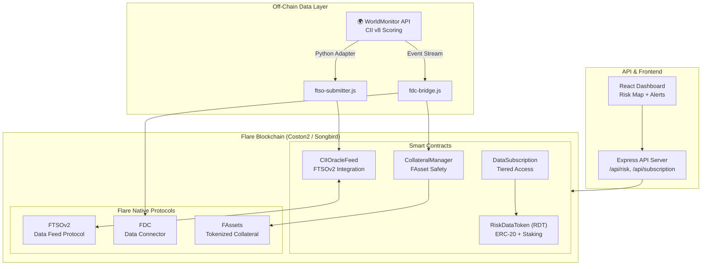

<div align="center">

# 🌍 FlareIntel

### On-Chain Geopolitical & Financial Intelligence

**Bringing verifiable country risk data on-chain via Flare's FTSOv2 & FDC**

[](https://soliditylang.org/)
[](LICENSE)
[](https://docs.flare.network/)
[](https://hardhat.org/)
[](https://docs.flare.network/tech/ftso/)

</div>

---

## 📖 Overview

FlareIntel is an on-chain intelligence platform that delivers **Composite Institutional Intelligence (CII) scores** — a 0–1000 risk index for 190+ countries — directly onto the Flare blockchain. By leveraging Flare's native **FTSOv2** oracle system for price feeds and the **FDC (Flare Data Connector)** for off-chain data attestation, FlareIntel creates a trustless, verifiable pipeline for geopolitical and financial risk data.

The platform introduces **Risk Data Token (RDT)**, an ERC-20 token that grants access to premium risk feeds. Stakers earn yield from subscription revenues, creating a sustainable data economy.

### Why Flare?

Flare is the only EVM-compatible chain with native, decentralized data acquisition protocols (FTSO, FDC) built into the consensus layer. This makes it the ideal network for bringing real-world intelligence on-chain without relying on centralized oracle bridges.

---

## ✨ Key Features

| Feature | Description |
|---|---|
| 🏛️ **CII Oracle Feed** | Country risk scores (0–1000) submitted via FTSOv2 for on-chain DApp consumption |
| 🔗 **FDC Bridge** | Off-chain WorldMonitor data attested through Flare Data Connector |
| 💰 **RDT Token** | ERC-20 with staking & yield — subscribers pay, stakers earn |
| 📊 **Tiered Subscriptions** | Free / Basic / Premium / Institutional access levels |
| 🛡️ **Collateral Manager** | FAsset-backed collateral safety for institutional positions |
| 🗺️ **Live Dashboard** | Real-time geopolitical risk visualization |

---

## 🏗️ Architecture



---

## 🚀 Installation

### Prerequisites

- Node.js >= 18.x
- Python >= 3.10 (for WorldMonitor adapter)
- A Flare Coston2 account with testnet FLR (from [faucet](https://faucet.flare.network/))

### Setup

```bash
# Clone the repository
git clone https://github.com/your-org/flareintel.git
cd flareintel

# Install dependencies
npm install

# Create .env file
cp .env.example .env
# Edit .env with your private key, RPC URL, etc.

# Compile contracts
npx hardhat compile

# Run tests
npx hardhat test

# Deploy to Coston2
npx hardhat run scripts/deploy.js --network coston2

# Start API server
node src/api/server.js

# Start FTSO submitter pipeline
node src/pipeline/ftso-submitter.js
```

### Environment Variables

| Variable | Description |
|---|---|
| `PRIVATE_KEY` | Deployer private key (Coston2) |
| `RPC_URL` | Flare Coston2 RPC endpoint |
| `FTSO_SUBMITTER_ADDRESS` | FTSOv2 submitter contract address |
| `FTSO_FEED_ADDRESS` | FTSOv2 feed contract address |
| `WORLDMONITOR_API_KEY` | WorldMonitor API key (if applicable) |
| `PORT` | API server port (default: 3001) |

---

## 📜 Contract Addresses (Coston2 Testnet)

| Contract | Address | Status |
|---|---|---|
| RiskDataToken (RDT) | `TBD after deploy` | ⏳ Pending |
| CIIOracleFeed | `TBD after deploy` | ⏳ Pending |
| DataSubscription | `TBD after deploy` | ⏳ Pending |
| CollateralManager | `TBD after deploy` | ⏳ Pending |

Run `npx hardhat run scripts/deploy.js --network coston2` to deploy and populate these addresses.

---

## 🧪 Testing

```bash
# Run all tests
npx hardhat test

# Run with gas reporting
REPORT_GAS=true npx hardhat test

# Run specific test
npx hardhat test test/RiskDataToken.test.js
```

---

## 📁 Project Structure

```
flareintel/
├── contracts/          # Solidity smart contracts
├── scripts/            # Hardhat deployment scripts
├── test/               # Contract tests
├── src/
│   ├── pipeline/       # Off-chain data pipelines
│   │   ├── ftso-submitter.js   # FTSOv2 CII submission client
│   │   ├── fdc-bridge.js       # FDC event attestation bridge
│   │   └── worldmonitor-adapter.py  # Python WorldMonitor adapter
│   ├── api/            # Express REST API
│   │   └── routes/     # API route handlers
│   └── dashboard/      # React frontend
└── docs/               # Documentation
```

---

## 👥 Team

FlareIntel is a hackathon project built for the Flare blockchain.

| Role | Member |
|---|---|
| Smart Contracts | FlareIntel Team |
| Data Pipeline | FlareIntel Team |
| Frontend | FlareIntel Team |

---

## 🙏 Upstream Credit

This project builds upon [**WorldMonitor**](https://github.com/koala73/worldmonitor) by **Elie Habib**, which provides the foundational CII v8 geopolitical scoring methodology. WorldMonitor is licensed under AGPL-3.0. See [docs/UPSTREAM_CREDIT.md](docs/UPSTREAM_CREDIT.md) for full attribution details.

---

## 📄 License

This project is licensed under the **GNU Affero General Public License v3.0 (AGPL-3.0)** — see the [LICENSE](LICENSE) file for details. This license was chosen to be compatible with the upstream WorldMonitor project.

---

<div align="center">

**Built on [Flare](https://flare.network/) — The Blockchain for Data**

</div>